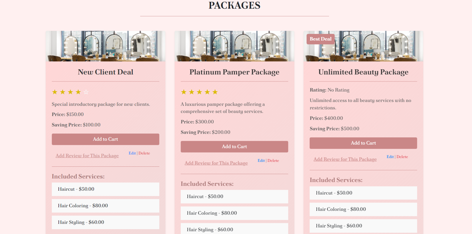
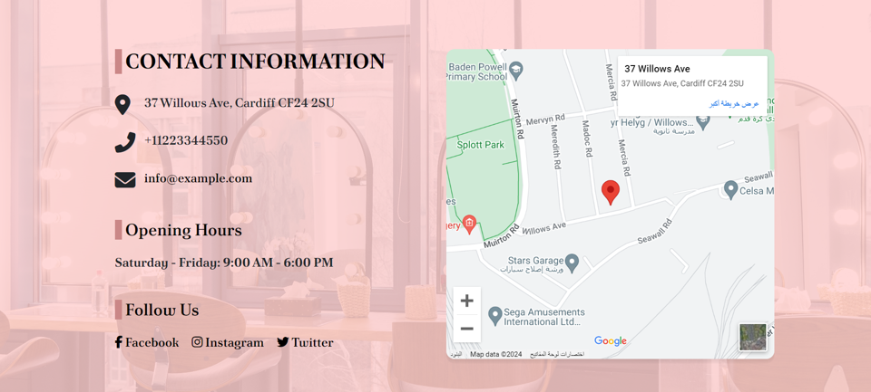
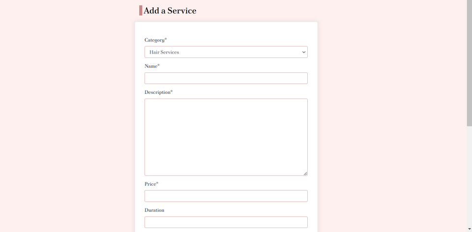
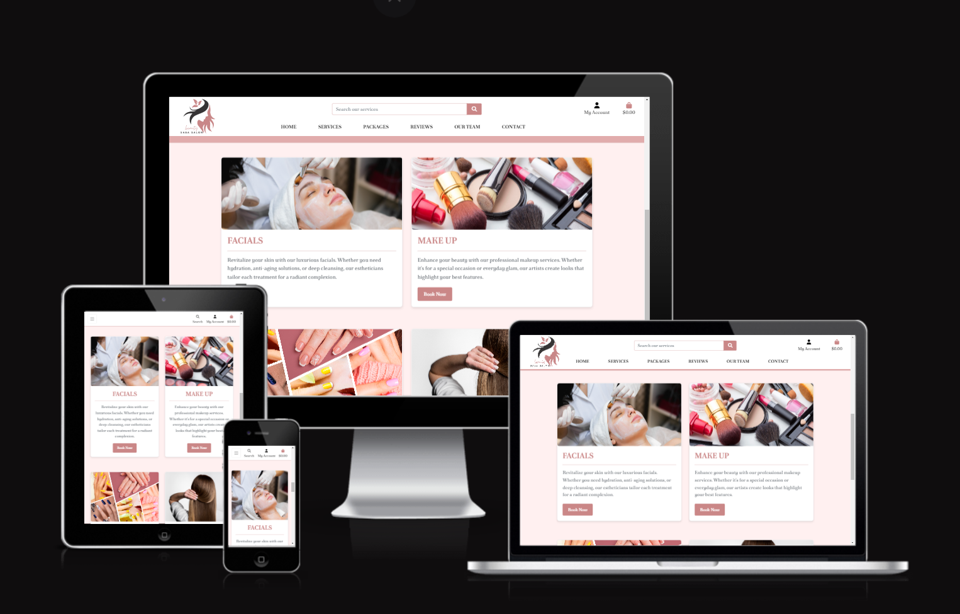

## Introduction

Welcome to the **Saba Salon Website**!

Saba Salon is a premier destination for beauty and wellness, committed to providing exceptional salon services in a luxurious and relaxing environment. Our website serves as your gateway to exploring our wide range of services and exclusive packages, reading client reviews, and booking your appointments with ease.

Discover our thoughtfully designed packages that offer exceptional value and a comprehensive salon experience, tailored to meet your beauty needs. Whether you're looking to refresh your look or indulge in a full pampering session, Saba Salon provides the perfect solutions for every occasion. 


# Table of Contents

1. [Introduction](#introduction)
2. [User Experience Design (UX) and UI](#user-experience-design-ux-and-ui)
   - [Key UX and UI Features](#key-ux-and-ui-features)
3. [User Stories](#user-stories)
4. [Features](#features)
5. [Future Features](#future-features)
6. [Presentation](#presentation)
7. [Look and Feel](#look-and-feel)
8. [Technologies Used](#technologies-used)
9. [Wireframes](#wireframes)
10. [Information Architecture](#information-architecture)
11. [Database Choice](#database-choice)
12. [Getting Started](#getting-started)
13. [Deployment](#deployment)
14. [Testing](#testing)
    - [Manual Testing](#manual-testing)
    - [Automated Testing](#automated-testing)
    - [Compatibility and Responsive Testing](#compatibility-and-responsive-testing)
15. [Bugs and Fixes for Saba Salon](#bugs-and-fixes-for-saba-salon)
    - [Issue 1: Handling Available Dates and Times](#issue-1-handling-available-dates-and-times)
    - [Issue 2: Adding Additional Services to a Booking](#issue-2-adding-additional-services-to-a-booking)
    - [Issue 3: Updating Cart Items](#issue-3-updating-cart-items)
    - [Issue 4: Webhook Handler Returning 500 Internal Server Error and No Confirmation Email Sent](#issue-4-webhook-handler-returning-500-internal-server-error-and-no-confirmation-email-sent)
16. [Credits](#credits)
17. [Contributing](#contributing)
18. [Acknowledgements](#acknowledgements)


## User Experience Design (UX) and UI

At Saba Salon, we prioritize delivering a seamless and intuitive digital experience through thoughtful User Experience (UX) and User Interface (UI) design. Our website is designed with your convenience and satisfaction in mind, ensuring that you have a pleasant and efficient experience while exploring our services and booking appointments.

### Key UX and UI Features

- **Intuitive Navigation**: Our website features a user-friendly navigation structure that makes it easy to find information about our services, packages, and booking options. Clear menus and well-organized content help you quickly access what you need.

- **Responsive Design**: The website is fully responsive, providing an optimal viewing experience across a wide range of devices, including desktops, tablets, and smartphones. Whether you're at home or on the go, you can easily browse and interact with our site.

- **Elegant Visual Design**: The visual design of our website reflects the luxurious and relaxing atmosphere of Saba Salon. We use a cohesive color scheme, elegant typography, and high-quality images to create an inviting and sophisticated aesthetic.

- **Effortless Booking System**: Our streamlined booking system allows you to schedule appointments with just a few clicks. You can choose from our range of services and packages, select your preferred date and time, and receive instant confirmation.

- **Client Reviews and Feedback**: Easily access and read reviews from our clients to make informed decisions about our services. Our review system is designed to be simple and informative, helping you understand the experiences of others.

- **Accessibility**: We are committed to ensuring our website is accessible to all users, including those with disabilities. Our design includes features such as alt text for images, keyboard navigation support, and color contrast adjustments.

- **Engaging Content**: Enjoy engaging content that provides detailed information about our services, packages, and promotions. Our content is designed to be informative and visually appealing, enhancing your overall experience.

At Saba Salon, we continuously strive to improve our website’s UX and UI to meet your needs and exceed your expectations. Your feedback is invaluable to us as we work towards creating the best possible online experience for our clients.

## User Stories

### 1. **As a New Visitor**
- **Goal:** I want to learn about Saba Salon's services and packages.
- **Experience:** I visit the **Home** page and easily find information about the various beauty and wellness services offered. I can navigate to the **Services** page where I see detailed descriptions and pricing. I also want to view available **Packages** and understand their benefits before making a decision.

### 2. **As a Returning Customer**
- **Goal:** I want to book an appointment quickly and easily.
- **Experience:** I log in to my account or use a guest booking option. I select the service I need, choose a date and time that works for me, and complete the booking process. I receive a confirmation email with all the details of my appointment.

### 3. **As a Client Looking for Reviews**
- **Goal:** I want to read reviews from other clients to make an informed decision about a service or package.
- **Experience:** I navigate to the **Reviews** section and see a list of client testimonials. I can read detailed feedback, view ratings, and see the date of each review. I appreciate the ability to filter or sort reviews to find relevant information.

### 4. **As a Potential Client Considering Packages**
- **Goal:** I want to understand the different packages available and their benefits.
- **Experience:** I visit the **Packages** page where I see a list of available packages, each with a detailed description, pricing, and what is included. I can compare packages and choose the one that best suits my needs.

### 5. **As a Registered User Looking to Update My Information**
- **Goal:** I want to update my personal details (phone number).
- **Experience:** I log into my account and access my profile settings. I can update my contact information and view my past appointments. I save the changes and receive a confirmation that my profile has been updated.

### 6. **As a Registered User Managing My Reviews**
- **Goal:** I want to add, view, and manage my reviews.
- **Experience:** I log into my account and navigate to the **Reviews** section of my profile. From here, I can:
  - **Add a Review:** Submit a review for a service or package I have used. I can provide feedback and rate the service.
  - **View My Reviews:** See a list of reviews I have previously submitted.
  - **Edit or Delete a Review:** Modify or remove any review I have submitted, if needed. I can update my feedback or ratings as necessary.

### 7. **As a Client Wanting to Know More About the Staff**
- **Goal:** I want to learn about the team of professionals at Saba Salon.
- **Experience:** I visit the **Our Team** page where I can view detailed profiles of the staff members, including their expertise, experience, and specialties. This helps me feel more informed and comfortable when choosing who to book an appointment with.

### 8. **As an Admin**
- **Goal:** I want to manage service listings, packages, staff information, and review content.
- **Experience:** I log into the admin dashboard where I can add, edit, or remove services and packages. I can also update staff profiles, and ensure that all information on the website is current and accurate.

### 9. **As a Client Who Wants to View Services in My Cart**
- **Goal:** I want to view the services in my cart and book them at any time.
- **Experience:** I can easily access my cart from any page and view the services I have added. I can book these services whenever I am ready.

### 10. **As a Client Who Wants to Search for a Service by Name**
- **Goal:** I want to search for a service by its name.
- **Experience:** I use the search bar to find specific services quickly by entering the service name. Relevant results appear promptly.

### 11. **As a Client Who Wants to View the Total of Booking at Any Time**
- **Goal:** I want to easily view the total cost of my booking.
- **Experience:** I can check the total cost of my booking at any point during the booking process, ensuring I am aware of the total before finalizing my appointment.

These user stories illustrate the various ways in which different types of users interact with the Saba Salon website, helping to ensure that their needs and goals are met effectively.

## Features

### **User Account Management**
- **User Registration:** New users can easily create an account by providing their email, password, and other necessary details. The registration process includes validation to ensure that all required fields are filled out correctly.
- **Email Confirmation:** After registering, users receive a confirmation email to verify their account. This step helps to ensure that the email provided is valid and that the account is secure. The user must confirm their email before they can access full account features.
- **Sign In:** Registered users can sign in to their account using their email and password. Upon successful login, users gain access to their account dashboard, where they can manage bookings, view past appointments, and edit personal information.
- **Sign Out:** Users can sign out from their account at any time, ensuring that their session is securely closed, especially when using shared or public devices.
- **Password Recovery:** If a user forgets their password, they can easily reset it by requesting a password recovery email. This email contains a secure link that allows the user to set a new password.


### **Home**
- **Introduction**: Provides an overview of Saba Salon, including highlights of our services.
- **Quick Links**: Easy navigation to other important sections such as Services, Packages, Reviews, and Contact.
- **Why Choose Us**: Learn why Saba Salon stands out with our commitment to exceptional service, luxurious environment, and experienced staff.
- **Search Functionality**: Easily find specific services using the search bar. Enter keywords to quickly locate what you need.


### **Services**
- **Detailed Service Information**: View a comprehensive list of all salon services with detailed descriptions and pricing.
- **Service Categories**: Browse services by categories to quickly find what you're looking for.
- **Direct Booking**: Book appointments for any service offered directly from the service detail page.
- **Add Additional Services**: During the booking process, add extra services to your appointment from the service detail page to customize your experience.
 - **Service Reviews**: Read all reviews related to a specific service to gauge client satisfaction and experiences. Reviews are available on the All Reviews page and can be filtered by rating.
- **Sort Services**: Organize services by popularity, price, or alphabetical order to simplify your search.
- **Search for a Service by Name:** Users can easily search for a service by name, enabling them to quickly find and book the specific service they are looking for.
- **Time Slot Management:** Each service has a predefined duration, which determines the available time slots. When a service is booked for a specific time slot, that slot becomes unavailable for booking by other clients, ensuring that no double bookings occur. 
- **Real-Time Availability:** The booking system updates in real-time, showing only available time slots based on the duration of the selected service. This ensures that clients have accurate information on when they can book their appointments.

 
 
 
 
 
 
 

### **Packages**
- **Package Listings**: Explore various packages designed to offer the best value and experience.
- **Package Details**: Detailed descriptions of each package, including what is included, pricing, and rating.
- **Best Deal**: Highlight packages that offer the greatest value for money based on savings. 




### **Cart Management**
- **Easy Checkout:** Complete your booking or purchase seamlessly through a straightforward checkout process.
- **Modify Appointments:** Change the date or time of your appointments directly from your cart before finalizing the booking.
- **Delete from Cart:** Remove any unwanted items or appointments from your cart with a simple delete option.
- **View Services in Cart:** Users can view the services they have added to their cart, allowing them to book any time or make adjustments as needed.
- **View Total of Booking:** Users can view the total cost of their booking at any time during the booking process, providing transparency and helping them make informed decisions.


### **Checkout and Payment Process**
- **Initiate Checkout:** Users can seamlessly proceed to checkout after adding items or services to their cart, ensuring a smooth transition from selection to payment.
- **Enter Payment Information:** The checkout process includes a secure form for entering payment details, providing users with a safe and reliable way to complete their transactions.
- **Confirm Payment:** Upon completion of payment, users are redirected to a confirmation page that confirms the success of the transaction and summarizes the details.
- **Confirmation Message:** After a successful payment, a confirmation message is displayed to users, including key information about the transaction, such as service details and payment summary.
- **Email Confirmation:** Users receive a detailed confirmation email with all relevant information regarding their booking or purchase. This email includes a summary of the services or items, the appointment date, and payment details, ensuring that users have all the information they need.


### **Reviews**
- **Client Testimonials**: Read reviews from other clients about their experiences with Saba Salon.
- **Review Filtering**: Filter reviews based on rating, service, or package to find relevant feedback. This allows users to view reviews that specifically address the service or package they are interested in.
- **Add a Review**: If logged in, you can submit your own review after a visit.


### **Our Team**
- **Staff Profiles**: View detailed profiles of our team members, including their expertise, experience, and specialties. Meet the professionals who provide exceptional services at Saba Salon.


### **User Profile**
- **Profile Management**: Access and update personal details, including contact information.
- **Appointment History**: View a history of past appointments and upcoming bookings.
- **Review History**: Access and manage reviews you have submitted.


### **Contact**
- **Contact Information**: Find our phone number, email, and physical address.
- **Location Map**: View a map with our salon’s location for easy navigation.



### **Admin Dashboard** *(for internal use)*
- **Manage Services**: Add, edit, or remove services offered by the salon.
- **Manage Packages**: Update package details, including pricing and descriptions.
- **Manage Staff**: Update staff profiles and information.





### **SweetAlert and Messages Integration**
- **Enhanced User Alerts**: Utilize SweetAlert for visually appealing and customizable alerts and confirmations.
- **Form Submissions**: Display stylish confirmation messages upon successful form submissions.
- **Error Handling**: Show clear and user-friendly error messages for any issues related to forms or bookings.
- **Dynamic Messages**: Incorporate dynamic messages for real-time updates and notifications, enhancing overall user interaction.


### **Responsive Design:**
- The web application is designed with a responsive layout, ensuring optimal viewing and interaction experiences across various devices and screen sizes.




### **Form Validation** 
- **Field Validation**: All forms ensure that mandatory fields are filled out before submission. This includes checks for:
  - **Email Format**: Valid email format must be used during registration and order processing.
  - **Phone Number Format**: Phone numbers must be validated to ensure they conform to accepted formats, preventing invalid entries.
  - **Name Validation**: Names must contain only letters and must not include numbers or special characters.
  - **At Least One Option Selected**: For fields with multiple choice options, at least one option must be selected to proceed.
  - **Confirmation Matches**: Ensure that password confirmation fields match during account creation and password recovery.
  - **Unique Values**: Fields like service names, package names, and staff member names must be unique, with checks to avoid conflicts during editing.
  - **Non-Empty Fields**: All required fields, such as name and description, must not be empty and must meet minimum character requirements.
  - **Positive Values**: Numeric fields, like prices, must be greater than zero and not negative.
- **Error Messages**: Clear, user-friendly error messages are displayed when validation fails, guiding users on how to correct their input.
- **Accessibility**: Forms are designed to be accessible, ensuring that all users, including those using assistive technologies, can successfully navigate and submit forms. Each field has appropriate labels, placeholders, and validation feedback.


These features are designed to provide a seamless and enjoyable experience for all users of the Saba Salon website, whether they are clients, potential clients, or administrators managing the site.


## Future Features

- **Coupons and Discount Codes**: Users can enter discount codes or coupons on the checkout page to apply promotions and adjust their final payment cost.

- **Additional Payment Methods**: Implement PayPal as an alternative payment method, providing users with more flexibility in how they pay for their services.

- **Enhanced Search Functionality:** Improved search options to include autocomplete suggestions and advanced filters for a more refined search experience.

- **Loyalty Program Integration:** Implementation of a loyalty program to reward returning customers with discounts and special offers.

- **Enhanced Review Analytics:** Tools for analyzing review trends and customer feedback to improve service quality.

- **Mobile App:** Development of a mobile app to provide users with a more convenient way to book appointments, view services, and receive notifications.

- **Social Media Integration:** Features to share reviews and experiences directly on social media platforms.

These future features are aimed at enhancing user experience, increasing engagement, and providing additional value to clients and administrators alike.


## Presentation

- **Information Layout**: The website is organized into clearly defined sections to facilitate easy access to information. Key sections include Home, Services, Packages, Reviews, Our Team, and Contact. Each section is designed to provide relevant information efficiently.

- **User Experience (UX)**: The website features an intuitive design with easy navigation. Users can quickly find and access the information they need through well-structured menus and clearly labeled sections. Responsive design ensures a seamless experience across all devices.

- **Interactive Elements**: Interactive elements such as service booking forms, package selections, and review filters are designed to be user-friendly. Visual feedback and confirmations are provided to guide users through their interactions.

- **Search and Filters**: The site includes search functionality and filters to help users quickly find specific services, packages, or reviews. Sorting options are available to organize information based on user preferences.

- **Cart Management**: Users can easily manage their cart, including adding, updating, or removing services. The cart interface allows users to modify booking details, such as changing the date or time, before finalizing their appointment.

- **SweetAlert Integration**: Stylish alerts and confirmations are used to enhance user interactions. This includes clear feedback for form submissions, booking confirmations, and error messages.

## Look and Feel

- **Visual Design**: The website features a modern, elegant design that reflects Saba Salon’s commitment to luxury and relaxation. The color palette, typography, and imagery are carefully selected to create a cohesive and appealing aesthetic.


- **Brand Consistency**: All design elements are aligned with Saba Salon’s brand identity. This includes the use of consistent colors, fonts, and logo placements throughout the website to reinforce brand recognition and create a unified user experience.

- **Responsive Design**: The website is designed to be fully responsive, ensuring that it looks and functions well on all devices, from desktop computers to mobile phones. Layouts and visual elements adjust dynamically to provide an optimal viewing experience.

- **User Interface (UI)**: The user interface is designed to be clean and uncluttered, with a focus on usability. Buttons, links, and other interactive elements are styled to be easily recognizable and accessible.

- **Accessibility**: The website incorporates accessibility best practices to ensure that all users, can navigate and use the site effectively. This includes readable fonts, high contrast colors, and alternative text for images.

- **Visual Feedback**: Clear visual feedback is provided for user actions, such as hover effects on buttons, transitions for interactive elements, and confirmation messages for successful actions.


## Technologies Used

### Tools
- **Gitpod**: Online IDE used for developing this project.
- **Django**: Python web framework for rapid development and clean design.
- **Stripe**: Payment platform to validate and accept credit card payments securely.
- **AWS S3 Bucket**: Storage solution for images entered into the database.
- **Boto3**: Library for creating, configuring, and managing AWS S3.
- **Django Crispy Forms**: Tool for styling Django forms.
- **Django Storages**: Collection of custom storage backends for Django, working with Boto3 and AWS S3.
- **Django Allauth**: Handles registration, login, logout, and password recovery actions.
- **Gunicorn**: WSGI HTTP server for UNIX, used for deploying the Django project to Heroku.
- **Pillow**: Python imaging library for processing image files stored in the database.
- **Psycopg2**: PostgreSQL database adapter for Python.
- **PIP3**: Package manager for installing tools needed in this project.
- **Git**: Version control system.
- **GitHub**: Platform for storing and sharing project code remotely.
- **Balsamiq**: Tool for creating wireframes for this project.


### Databases
- **PostgreSQL**: Production database provided by Heroku.
- **SQLite3**: Development database provided by Django.

### Libraries
- **JQuery**: Simplifies DOM manipulation.
- **Bootstrap**: Framework for structuring the website and ensuring responsiveness.
- **FontAwesome**: Provides icons for the website.
- **Google Fonts**: Used for styling website fonts.

### Languages
- **HTML**: Markup language for creating web pages.
- **CSS**: Stylesheet language for designing web pages.
- **JavaScript**: Programming language for creating interactive web elements.
- **Python**: Programming language used for backend development with Django.


## Wireframes

These wireframes were created using **Balsamiq** during the Scope Plane phase of the design and planning process for this project. Wireframes are a crucial component in the design phase, providing a clear outline of the website's structure and layout before diving into detailed design and development.

Initially, I used Balsamiq to sketch out my ideas after conducting research. This approach was effective for organizing my thoughts and evaluating which concepts were most viable. However, as the project progressed, I found myself rethinking some of the initial proposals and decided to explore alternative ideas. Despite these changes, the core structure of the wireframes remained intact and was faithfully reflected in the final design.


#### Desktop


#### Smart Phone


#### Tablet


## Information Architecture

The application is structured around the following key components:

- **Users:** Users can register, log in, and manage their accounts to access personalized features and interact with the platform.
- **Orders:** Orders track user transactions, including details such as customer information, order total, and payment status.
- **Services:** Services represent individual salon offerings, including their descriptions, pricing, and available times.
- **Packages:** Packages bundle multiple services together, often at a discounted rate, and can be reviewed by users.
- **Bookings:** Bookings manage the scheduling of services and packages for users, including date and time information.
- **Reviews:** Reviews allow users to provide feedback on services and packages, including ratings and comments.
- **Team:** The team section provides information about the staff members, including their roles, bios, and contact details.

## Database Choice

| **Database** | **Usage**        | **Reason**                                          |
|--------------|------------------|-----------------------------------------------------|
| PostgreSQL   | Production       | Robust, scalable, and feature-rich for production environments. |
| SQLite       | Development      | Lightweight and easy to set up, suitable for development and testing. |

## Data Models

## Checkout App

| **Model** | **Field**       | **Description**                           |
|-----------|-----------------|-------------------------------------------|
| **Order** | `order_number`  | Unique identifier for the order.          |
|           | `user_profile`  | Linked user profile.                      |
|           | `user`          | Linked user.                              |
|           | `full_name`     | Customer’s full name.                     |
|           | `email`         | Customer’s email address.                 |
|           | `phone_number`  | Customer’s phone number.                  |
|           | `date`          | Date and time when the order was created. |
|           | `order_total`   | Total cost of the order before taxes.     |
|           | `grand_total`   | Final amount including any taxes or discounts. |
|           | `original_cart` | JSON field storing original cart data.    |
|           | `stripe_pid`    | Payment identifier from Stripe.           |

## Packages App

| **Model** | **Field**       | **Description**                                |
|-----------|-----------------|------------------------------------------------|
| **Package** | `name`         | Name of the package.                          |
|           | `description`   | Detailed description of the package.          |
|           | `price`         | Regular price of the package.                 |
|           | `saving_price`  | Discounted price if applicable.               |
|           | `services`      | Many-to-many relationship with `Service`.     |

## Profile App

| **Model** | **Field**           | **Description**                    |
|-----------|---------------------|------------------------------------|
| **UserProfile** | `user`          | Linked user.                        |
|           | `default_phone_number` | Default phone number for the user. |

## Reviews App

| **Model** | **Field**        | **Description**                                 |
|-----------|------------------|-------------------------------------------------|
| **Review** | `service`       | Foreign key linking to `Service`.               |
|           | `package`       | Foreign key linking to `Package`.               |
|           | `user`          | User who left the review.                      |
|           | `rating`        | Rating given by the user (1-5).                |
|           | `comment`       | Review comment.                               |
|           | `created_at`    | Timestamp when the review was created.        |

## Services App

| **Model** | **Field**          | **Description**                                          |
|-----------|--------------------|----------------------------------------------------------|
| **Category** | `name`          | Name of the category.                                   |
|           | `friendly_name`    | User-friendly name for display purposes.                |
| **Service** | `category`       | Foreign key linking to `Category`.                      |
|           | `name`            | Name of the service.                                   |
|           | `description`     | Description of the service.                            |
|           | `price`           | Cost of the service.                                  |
|           | `duration`        | Duration of the service.                              |
|           | `image`           | Image related to the service.                         |
|           | `available_times` | JSON field for storing available time slots.          |
| **Booking** | `user`          | Foreign key linking to `User`.                          |
|           | `service`        | Foreign key linking to `Service`.                      |
|           | `package`        | Foreign key linking to `Package`.                      |
|           | `date`           | Date of the booking.                                  |
|           | `time`           | Time of the booking.                                  |
|           | `created_at`     | Timestamp when the booking was created.               |
|           | `order`          | Foreign key linking to `Order`.                       |

## Team App

| **Model** | **Field**        | **Description**                                  |
|-----------|------------------|--------------------------------------------------|
| **StaffMember** | `name`      | Name of the staff member.                       |
|           | `position`       | Position or role of the staff member.           |
|           | `bio`            | Short biography.                                |
|           | `photo`          | Image of the staff member.                      |
|           | `email`          | Contact email.                                  |
|           | `phone_number`   | Contact phone number.                           |


## Entity-Relationship Diagram
```bash
+-----------------+      +---------------------+
|   UserProfile   |      |     StaffMember     |
|-----------------|      |---------------------|
| user_id (PK)    |      | staff_id (PK)       |
| default_phone   |      | name                |
| ...             |      | position            |
+-----------------+      | bio                 |
         | 1             | photo               |
         |               | email               |
         | N             | phone_number        |
         |               +---------------------+
+-----------------+               |
|      Review     |               |
|-----------------|               |
| review_id (PK)  |               |
| rating          |               |
| comment         |               |
| created_at      |               |
| user_id (FK)    |               |
| service_id (FK) |               |
| package_id (FK) |               |
+-----------------+               |
         | N                      |
         | 1                      |
         |                        |
+-----------------+      +---------------------+
|      Order      |      |       Package       |
|-----------------|      |---------------------|
| order_number (PK)|      | package_id (PK)     |
| user_profile_id  |      | name                |
| user_id (FK)     |      | description         |
| full_name        |      | price               |
| email            |      | saving_price        |
| phone_number     |      +---------------------+
| date             |
| order_total      |       +-----------------+
| grand_total      |       |     Service      |
| original_cart    |       |-----------------|
| stripe_pid       |       | service_id (PK)  |
+-----------------+       | category_id (FK)  |
         | 1              | name              |
         |                | description       |
         | N              | price             |
         |                | duration          |
         |                | image             |
+-----------------+       | available_times   |
|     Booking     |       +-----------------+
|-----------------|
| booking_id (PK) |
| user_id (FK)    |
| service_id (FK) |
| package_id (FK) |
| date            |
| time            |
| created_at      |
| order_id (FK)   |
+-----------------+
```

## Entities and Attributes

### 1. Order
| Field              | Description                                    |
|--------------------|------------------------------------------------|
| `order_number (PK)`| Unique identifier for the order.               |
| `user_profile_id (FK)` | Linked user profile.                     |
| `user_id (FK)`     | Linked user.                                   |
| `full_name`        | Customer’s full name.                          |
| `email`            | Customer’s email address.                      |
| `phone_number`     | Customer’s phone number.                       |
| `date`             | Date and time when the order was created.     |
| `order_total`      | Total cost of the order before taxes.         |
| `grand_total`      | Final amount including any taxes or discounts. |
| `original_cart`    | JSON field storing original cart data.        |
| `stripe_pid`       | Payment identifier from Stripe.                |

### 2. Package
| Field                   | Description                                  |
|-------------------------|----------------------------------------------|
| `package_id (PK)`      | Unique identifier for the package.          |
| `name`                  | Name of the package.                        |
| `description`           | Detailed description of the package.        |
| `price`                 | Regular price of the package.               |
| `saving_price`          | Discounted price if applicable.             |
| `services`              | Many-to-many relationship with `Service`, indicating that multiple services can be associated with a single package, and vice versa. |


### 3. UserProfile
| Field                | Description                                   |
|----------------------|-----------------------------------------------|
| `user_id (PK)`       | Unique identifier for the user profile.     |
| `default_phone_number`| Default phone number for the user.          |

### 4. Review
| Field               | Description                                   |
|---------------------|-----------------------------------------------|
| `review_id (PK)`    | Unique identifier for the review.            |
| `service_id (FK)`   | Foreign key linking to Service.               |
| `package_id (FK)`   | Foreign key linking to Package.               |
| `user_id (FK)`      | User who left the review.                     |
| `rating`            | Rating given by the user (1-5).              |
| `comment`           | Review comment.                               |
| `created_at`        | Timestamp when the review was created.       |

### 5. Service
| Field               | Description                                   |
|---------------------|-----------------------------------------------|
| `service_id (PK)`   | Unique identifier for the service.           |
| `category_id (FK)`  | Foreign key linking to Category.             |
| `name`              | Name of the service.                         |
| `description`       | Description of the service.                  |
| `price`             | Cost of the service.                         |
| `duration`          | Duration of the service.                     |
| `image`             | Image related to the service.                |
| `available_times`    | JSON field for storing available time slots. |

### 6. Booking
| Field               | Description                                   |
|---------------------|-----------------------------------------------|
| `booking_id (PK)`   | Unique identifier for the booking.           |
| `user_id (FK)`      | Foreign key linking to UserProfile.          |
| `service_id (FK)`   | Foreign key linking to Service.              |
| `package_id (FK)`   | Foreign key linking to Package.              |
| `date`              | Date of the booking.                         |
| `time`              | Time of the booking.                         |
| `created_at`        | Timestamp when the booking was created.     |
| `order_id (FK)`     | Foreign key linking to Order.                |

### 7. StaffMember
| Field               | Description                                   |
|---------------------|-----------------------------------------------|
| `staff_id (PK)`     | Unique identifier for the staff member.      |
| `name`              | Name of the staff member.                    |
| `position`          | Position or role of the staff member.       |
| `bio`               | Short biography.                              |
| `photo`             | Image of the staff member.                   |
| `email`             | Contact email.                               |
| `phone_number`      | Contact phone number.                        |

## Relationships

- **Order**:
  - **1-to-1** with **UserProfile** (`user_profile_id`)
  - **1-to-many** with **Booking** (`order_id`)

- **Package**:
  - **Many-to-many** with **Service** (through a join table)
  - **1-to-many** with **Review** (`package_id`)

- **UserProfile**:
  - **1-to-many** with **Review** (`user_id`)
  - **1-to-many** with **Booking** (`user_id`)
  - **1-to-1** with **User** 

- **Review**:
  - **Many-to-1** with **Service** (`service_id`)
  - **Many-to-1** with **Package** (`package_id`)

- **Service**:
  - **1-to-many** with **Booking** (`service_id`)
  - **Many-to-1** with **Category** (`category_id`)
  - **Many-to-many** with **Package** (through the join table)

- **Booking**:
  - **Many-to-1** with **UserProfile** (`user_id`)
  - **Many-to-1** with **Service** (`service_id`)
  - **Many-to-1** with **Package** (`package_id`)
  - **1-to-1** with **Order** (`order_id`)


## Getting Started

To run this project locally, follow the instructions below:

## Prerequisites

Ensure you have the following tools installed:
- An IDE such as Visual Studio Code
- Python 3
- PIP
- Git

Additionally, create free accounts with the following services:
- [Stripe](https://stripe.com) for payment processing
- [AWS](https://aws.amazon.com) and set up an S3 bucket for file storage

Refer to the documentation linked above for setting up these services and retrieving the necessary environment variables.

## Instructions

1. **Clone the Repository**

   Save a copy of the GitHub repository by clicking the "Download ZIP" button on the repository page and extract it to your chosen folder. Alternatively, if you have Git installed, you can clone the repository with the following command:

   ```bash
   git clone https://github.com/SABA-SALEH/saba_salon.git

2.**Set Up a Virtual Environment**

- Navigate to the project directory and create a virtual environment:

 ```bash
python -m venv venv
 ```
- Activate the virtual environment:

  -On Windows:

 ```bash
.\venv\Scripts\activate
 ```
   -On macOS/Linux:
 ```bash
source venv/bin/activate
 ```
If you encounter issues with the **python** command, you may need to use python3 or py instead.

3.**Upgrade Pip**

Ensure you have the latest version of pip:

 ```bash
pip install --upgrade pip
 ```

4.**Install Required Modules**

Install all required modules listed in requirements.txt:

 ```bash
pip install -r requirements.txt
 ```

5.**Set Up Environment Variables**

Configure the following environment variables in your IDE. For VSCode, update the settings.json file within the .vscode directory:

```json

"terminal.integrated.env.windows": {
    "HOSTNAME": "<enter hostname here>",
    "AWS_ACCESS_KEY_ID": "<enter key here>",
    "AWS_SECRET_ACCESS_KEY": "<enter key here>",
    "DATABASE_URL": "<enter key here>",
    "EMAIL_HOST_PASS": "<enter key here>",
    "EMAIL_HOST_USER": "<enter url here>",
    "SECRET_KEY": "<enter key here>",
    "STRIPE_PUBLIC_KEY": "<enter key here>",
    "STRIPE_SECRET_KEY": "<enter key here>",
    "STRIPE_WH_SECRET": "<enter key here>",
    "USE_AWS": "True",
    "AWS_STORAGE_BUCKET_NAME": "<enter bucket name here>"
}
```
Note: Replace placeholders with your actual environment values. Restart your IDE or machine to ensure the environment variables are active.

6.**Apply Migrations**

Create the database schema using Django’s migration system:

```bash
python manage.py migrate
```

7.**Create a Superuser**

Create an admin user to access the Django admin panel:

```bash
python manage.py createsuperuser
```
Follow the prompts to enter your username, email, and password.

8.**Run the Development Server**

Start the Django development server:

```bash
python manage.py runserver
```
Open your browser and navigate to http://127.0.0.1:8000/ to view the application.

## Deployment
To deploy this project to Heroku, follow these steps:

### Prerequisites
Ensure you have the Heroku CLI installed.

### Steps
#### Prepare for Deployment

- Create a requirements.txt file:

```bash
pip freeze > requirements.txt
```
- Create a Procfile in the root directory with the following content:

```makefile
web: gunicorn saba_salon.wsgi:application
```
Replace saba_salon with the name of your Django project if it differs.

#### Push to GitHub

Commit and push your changes to GitHub:

```bash
git add .
git commit -m "Prepare for deployment"
git push origin main
```

#### Create a Heroku App

Log in to Heroku and create a new app:

```bash
heroku create saba-salon
``` 

#### Add PostgreSQL Add-on

Add the Heroku Postgres add-on for database management:

```bash
heroku addons:create heroku-postgresql:hobby-dev
```

#### Set Config Vars

Set the necessary environment variables in Heroku:

```bash
heroku config:set AWS_ACCESS_KEY_ID=<enter key here>
heroku config:set AWS_SECRET_ACCESS_KEY=<enter key here>
heroku config:set DATABASE_URL=<enter db url here>
heroku config:set EMAIL_HOST_PASS=<enter password here>
heroku config:set EMAIL_HOST_USER=<enter user here>
heroku config:set SECRET_KEY=<enter secret key here>
heroku config:set STRIPE_PUBLIC_KEY=<enter public key here>
heroku config:set STRIPE_SECRET_KEY=<enter secret key here>
heroku config:set STRIPE_WH_SECRET=<enter webhook secret here>
heroku config:set USE_AWS=True
heroku config:set AWS_STORAGE_BUCKET_NAME=<enter bucket name here>
```
#### Deploy to Heroku

Deploy the application to Heroku:

```bash
git push heroku main
```

#### Run Migrations on Heroku

Apply database migrations:

```bash
heroku run python manage.py migrate
```

#### Create a Superuser

Create an admin user for the Heroku app:

```bash
heroku run python manage.py createsuperuser
```
#### Open the App

Open your deployed application in the browser:

```bash
heroku open
```
Alternatively, navigate to https://saba-salon-2875b1e9e4e8.herokuapp.com/ to view the live site.

For more details, consult the Heroku DevCenter.

## Testing

### Manual Testing

For Saba Salon, manual testing was conducted to ensure all features and functionalities work as intended and provide a smooth user experience. The following scenarios were manually tested:

1. **Home Page:**
   - **Introduction:** Verified that the home page provides a clear overview of Saba Salon and highlights the key services.
   - **Quick Links:** Tested that links to Services, Packages, Reviews, Our team and Contact sections navigate correctly.
   - **Why Choose Us:** Ensured that the section detailing why Saba Salon stands out is informative and displays correctly.
   - **Search Functionality:** Checked that the search bar allows users to find specific services by entering keywords.

2. **Services:**
   - **Detailed Service Information:** Verified that users can view a comprehensive list of salon services with accurate descriptions and pricing.
   - **Service Categories:** Tested that users can browse services by categories and that each category displays relevant services.
   - **Direct Booking:** Ensured users can book appointments directly from the service detail page.
   - **Add Additional Services:** Checked that users can add extra services to their appointment during the booking process.
   - **Service Reviews:** Verified that reviews for each service can be read . Checked that the All Reviews page displays correctly.
   - **Sort Services:** Tested sorting options (popularity, price, alphabetical order) to ensure services are organized as expected.

3. **Packages:**
   - **Package Listings:** Verified that users can explore various packages designed to offer value and experience.
   - **Package Details:** Checked that each package's details, including what is included, pricing, and ratings, are displayed correctly.
   - **Best Deal:** Ensured that the system highlights the best deal based on savings.

   
4. **Cart Management:**
   - **Easy Checkout:** Ensured the checkout process is seamless for bookings or purchases.
   - **Modify Appointments:** Verified that users can change the date or time of their appointments from the cart.
   - **Delete from Cart:** Checked that users can remove unwanted items or appointments from the cart.

5. **Checkout and Payment Process:**
   - **Initiate Checkout:** Verified that users can proceed to checkout after adding items or services to their cart.
   - **Enter Payment Information:** Ensured that users can enter payment details securely.
   - **Confirm Payment:** Tested that the payment process completes successfully and users are redirected to a confirmation page.
   - **Confirmation Message:** Verified that a confirmation message is displayed upon successful payment, including details of the transaction.
   - **Email Confirmation:** Ensured that users receive an email with all relevant information about their booking or purchase, including a summary of the services or items, the appointment date, and payment details.

6. **Reviews:**
   - **Client Testimonials:** Verified that client testimonials are displayed accurately.
   - **Review Filtering:** Tested that reviews can be filtered by rating, service, or package to find relevant feedback.
   - **Add a Review:** Checked that logged-in users can submit their own reviews.
   
7. **Our Team:**
   - **Staff Profiles:** Ensured that detailed profiles of team members, including their expertise and specialties, are displayed correctly.

8. **User Profile:**
   - **Profile Management:** Verified that users can access and update personal details, including contact information.
   - **Appointment History:** Checked that users can view their past appointments.
   - **Review History:** Verified that users can access and manage their submitted reviews.

9. **Contact:**
   - **Contact Information:** Ensured that phone number, email, and physical address are displayed correctly.
   - **Location Map:** Verified that the map showing the salon’s location is functional and accurate.

10. **Admin Dashboard (for internal use):**
    - **Manage Services:** Verified that administrators can add, edit, or remove services.
    - **Manage Packages:** Checked that administrators can update package details, including pricing and descriptions.
    - **Manage Staff:** Ensured that staff profiles can be updated by administrators.

11. **SweetAlert and Messages Integration:**
    - **Enhanced User Alerts:** Verified that SweetAlert is used for visually appealing alerts and confirmations.
    - **Form Submissions:** Checked that stylish confirmation messages are displayed upon successful form submissions.
    - **Error Handling:** Ensured clear and user-friendly error messages are shown for any issues related to forms or bookings.
    - **Dynamic Messages:** Verified that dynamic messages for real-time updates and notifications are integrated effectively.

12. **Responsive Design:**
    - **Testing on Devices and Screen Sizes:** Verified that the application’s layout adapts to various devices and screen sizes, providing an optimal viewing experience.

These tests ensure that all features of Saba Salon are functioning correctly and provide a seamless experience for users.

### **Client Stories Testing**

To ensure that the website meets client needs, the following scenarios were tested based on user stories:

#### 1. **New Visitor Experience**
- **User Story:** As a New Visitor, I want to learn about Saba Salon's services and packages.
- **Testing Scenarios:**
  - Validated the ease of accessing information about services and packages from the **Home** page.
  - Ensured that navigation to the **Services** page and **Packages** page is intuitive and provides clear information.

#### 2. **Returning Customer Experience**
- **User Story:** As a Returning Customer, I want to book an appointment quickly and easily.
- **Testing Scenarios:**
  - Tested the smoothness of the booking process, including selecting services, choosing dates, and completing the booking.
  - Verified the accuracy of confirmation emails sent after a successful booking.

#### 3. **Client Reviews**
- **User Story:** As a Client Looking for Reviews, I want to read reviews from other clients to make an informed decision about a service or package.
- **Testing Scenarios:**
  - Checked that users can effectively navigate the **Reviews** section.
  - Ensured that users can filter reviews based on different criteria.
  - Tested the functionality for adding new reviews, including submitting feedback and rating services.

#### 4. **Package Comparison**
- **User Story:** As a Potential Client Considering Packages, I want to understand the different packages available and their benefits.
- **Testing Scenarios:**
  - Ensured users can view and compare different packages on the **Packages** page.
  - Verified that package details, including descriptions, pricing, and what is included, are displayed correctly.
  - Tested the functionality for comparing packages to determine the best value.

#### 5. **Profile Management**
- **User Story:** As a Registered User Looking to Update My Information, I want to update my personal details (e.g., phone number).
- **User Story:** As a Registered User Managing My Reviews, I want to add, view, and manage my reviews.
- **Testing Scenarios:**
  - Tested the ability to update personal details from the user profile settings.
  - Verified the functionality for viewing, editing, and deleting reviews from the user profile.
  - Ensured that changes to personal details and reviews are saved correctly and confirmed to the user.

#### 6. **Cart Management and Search**
- **User Story:** As a Client Who Wants to View Services in My Cart, I want to view the services in my cart and book them at any time.
- **User Story:** As a Client Who Wants to Search for a Service by Name, I want to search for a service by its name.
- **User Story:** As a Client Who Wants to View the Total of Booking at Any Time, I want to easily view the total cost of my booking.
- **Testing Scenarios:**
  - Verified that users can view the services in their cart and book them at any time.
  - Ensured that the search functionality allows users to search for services by name effectively.
  - Checked that users can easily view the total cost of their booking at any point during the booking process.

#### 7. **Checkout and Payment Process**
- **User Story:** As a Client Who Wants to Complete Their Purchase or Booking, I want a smooth checkout and payment process.
- **Testing Scenarios:**
  - **Initiate Checkout:** Verified that users can seamlessly proceed to checkout after adding items or services to their cart.
  - **Enter Payment Information:** Ensured that the checkout process includes a secure form for entering payment details.
  - **Confirm Payment:** Tested that upon completion of payment, users are redirected to a confirmation page summarizing the transaction.
  - **Confirmation Message:** Verified that a confirmation message is displayed after a successful payment, including service details and payment summary.
  - **Email Confirmation:** Ensured that users receive a detailed confirmation email with a summary of the services or items, the appointment date, and payment details.

#### 8. **Cart Management Features**
- **User Story:** As a Client Who Wants to Manage Their Cart, I want to modify and delete items from my cart easily.
- **Testing Scenarios:**
  - **Easy Checkout:** Validated that users can complete their booking or purchase seamlessly through a straightforward checkout process.
  - **Modify Appointments:** Ensured users can change the date or time of their appointments directly from their cart before finalizing the booking.
  - **Delete from Cart:** Verified that users can remove any unwanted items or appointments from their cart with a simple delete option.

### **Admin Stories Testing**

To ensure that the website meets administrative needs, the following scenarios were tested based on user stories:

#### 1. **Manage Service Listings**
- **User Story:** As an Admin, I want to manage service listings on the website.
- **Testing Scenarios:**
  - Verified that admins can add, edit, or remove services from the **Services** page.
  - Ensured that changes to service listings are updated and displayed correctly on the website.

#### 2. **Manage Packages**
- **User Story:** As an Admin, I want to manage service packages on the website.
- **Testing Scenarios:**
  - Tested the ability to add, edit, or remove packages from the **Packages** page.
  - Ensured that updates to packages are reflected accurately and immediately on the website.

#### 3. **Manage Staff Information**
- **User Story:** As an Admin, I want to manage staff information on the website.
- **Testing Scenarios:**
  - Verified that admins can update staff profiles, including their expertise, experience, and specialties.
  - Ensured that changes to staff information are displayed correctly on the **Our Team** page.

#### 4. **Maintain Website Accuracy**
- **User Story:** As an Admin, I want to ensure that all information on the website is current and accurate.
- **Testing Scenarios:**
  - Ensured that all updates made to services, packages, staff information, and reviews are reflected accurately on the website.
  - Verified that any outdated or incorrect information is corrected promptly.


### Automated Testing
#### Code Validation:

1.	**HTML Validator:**
	- Validate HTML code for all pages to ensure compliance with standards.

    
    
    
  
  - Error: Duplicate ID user-options

  - Details: The error indicates that the id attribute user-options has been used more than once in the HTML code. 
  - Cause of the Error: The duplicate ID error occurred because the same id attribute value was assigned to 
    multiple elements within the same page. Specifically, in the templates for different screen sizes (mobile and desktop), both elements used the id user-options:

    - Mobile View: 
    ``` html <a class="text-black nav-link d-block d-lg-none" href="#" id="user-options" ... >```

    - Desktop View: ``` html <a class="text-black nav-link" href="#" id="user-options" ... > ```
    
    This duplication happens because the same id was used for elements that are conditionally rendered based on screen size.


2.	**CSS Validator:**
	- Check stylesheets for compliance with CSS standards and fix any issues.

    
    
    


3.	**JS Validator:**
	- Validate JavaScript code syntax and maintain code quality.

    
     

4. **Python Linter:**
   - Use a Python linter to validate Python code syntax and maintain code quality.

   
   
   
   
   
5. **flake8:**
   - `flake8` is used to check the Python code for style guide enforcement and linting errors.
   - Ensure code adheres to PEP 8 standards and identifies potential issues in the codebase.

   
   
   

   - Errors:

   1. **Line Too Long** (`E501`):
     
   2. **Imported but Unused** (`F401`):


#### Lighthouse Audit:
1.  Assess performance, accessibility, and best practices using Lighthouse.
2.  Optimize performance and address any identified issues.


   **Best Practices Score:**
   - You may notice that the **Best Practices** score is lower than expected. This is primarily due to recent changes in browser privacy policies, specifically regarding third-party cookies.

   **Reason for Low Best Practices Score:**
   - As part of the Privacy Sandbox initiative, Chrome and other browsers are increasingly restricting third-party cookies to enhance user privacy. For instance, Stripe, which is used for payment processing on this site, relies on third-party cookies to function properly. 


### Compatibility and Responsive Testing

#### Browser Testing:
1.	Google Chrome:
	- Test the application thoroughly on Google Chrome to ensure compatibility and functionality.


2.	Mozilla Firefox:
	- Verify compatibility and functionality on Mozilla Firefox.


3.	Microsoft Edge:
	- Test on Microsoft Edge to ensure seamless user experience.
    
    
#### Mobile Testing:
1.	iPhone and Android Devices:
	- Test the application on various mobile devices to ensure compatibility and responsiveness.
	- Verify that all features work well on mobile browsers such as Chrome and Safari.
    
    - Iphone
       
    - Samsung
       


## Bugs and Fixes for Saba Salon
### Issue 1: Handling Available Dates and Times
**Bug:** The application did not provide functionality to retrieve available dates and times for booking a service. Users needed this feature to see open slots and make informed choices when scheduling an appointment.

**Fix:** To resolve this, I implemented a feature to get available and booked times for each service. Here’s a step-by-step breakdown:

**Backend Implementation:**

- Created a View to Handle Available and Booked Times:
  -  Implemented views to return available and booked times based on the selected date.
- Added get_available_times and get_booked_times Functions:
  - Implemented functions to manage and provide the necessary data for available and booked times.

```python
def get_available_times(request, service_id):
    if request.method == 'GET' and 'booking_date' in request.GET:
        service = get_object_or_404(Service, pk=service_id)
        booking_date = request.GET['booking_date']
        available_times = service.get_available_times(booking_date)
        data = {
            'available_times': available_times
        }
        return JsonResponse(data)
    else:
        return JsonResponse({'error': 'Invalid request'}, status=400)

def get_booked_times(request, service_id):
    if request.method == 'GET' and 'booking_date' in request.GET:
        service = get_object_or_404(Service, pk=service_id)
        booking_date = request.GET['booking_date']
        booked_times_qs = Booking.objects.filter(service=service, date=booking_date).values_list('time', flat=True)
        booked_times = list(booked_times_qs)
        data = {
            'booked_times': booked_times
        }
        return JsonResponse(data)
    else:
        return JsonResponse({'error': 'Invalid request'}, status=400)
```

**Frontend Implementation:**

Implemented JavaScript to fetch available and booked times and update the booking form accordingly.

```javascript
function fetchAvailableAndBookedTimes(serviceId, date, timeSelectElement) {
    var availableTimesUrl = `/services/${serviceId}/get_available_times/?booking_date=${date}`;
    var bookedTimesUrl = `/services/${serviceId}/get_booked_times/?booking_date=${date}`;

    fetch(availableTimesUrl)
        .then(response => response.json())
        .then(data => {
            fetch(bookedTimesUrl)
                .then(response => response.json())
                .then(bookedTimesData => {
                    var availableTimes = data.available_times;
                    var bookedTimes = bookedTimesData.booked_times;

                    var filteredTimes = availableTimes.filter(time => !bookedTimes.includes(time));

                    timeSelectElement.innerHTML = '<option value="" disabled selected>Select a time</option>';

                    filteredTimes.forEach(function(timeSlot) {
                        var option = document.createElement('option');
                        option.value = timeSlot;
                        option.textContent = timeSlot;
                        timeSelectElement.appendChild(option);
                    });
                })
                .catch(error => console.error('Error fetching booked times:', error));
        })
        .catch(error => console.error('Error fetching available times:', error));
}
```


### Issue 2: Adding Additional Services to a Booking
**Bug:** The application lacked functionality for users to add additional services to their existing bookings. This was necessary for users who wanted to book multiple services in a single transaction.

**Fix:** Implemented functionality to add additional services to a booking by creating an interface to select and add extra services.

**Frontend Implementation:**
- Added a section to the booking form to manage additional services.
- Used JavaScript to handle the display and selection of additional services.

```html
<div id="additionalServiceContainer" style="display: none;">
    <label for="additional_service_select">Add Another Service:</label>
    <select id="additional_service_select">
        <!-- Options will be populated dynamically -->
    </select>
    <label for="additional_booking_date">Choose Date:</label>
    <input type="date" id="additional_booking_date">
    <label for="additional_booking_time">Choose Time:</label>
    <select id="additional_booking_time">
        <!-- Options will be populated dynamically -->
    </select>
</div>

<button id="toggleAdditionalService">Add Another Service</button>

```

**JavaScript Implementation:**
- Managed the addition of services and their respective booking details.

```javascript
document.getElementById('toggleAdditionalService').addEventListener('click', function(event) {
    var additionalServiceContainer = document.getElementById('additionalServiceContainer');
    if (additionalServiceContainer.style.display === 'none') {
        additionalServiceContainer.style.display = 'block';
        event.target.textContent = 'Cancel Adding';
    } else {
        additionalServiceContainer.style.display = 'none';
        event.target.textContent = 'Add Another Service';
    }
});

```

### Issue 3: Updating Cart Items
**Bug:** Users were unable to update the date and time for services in their cart and only view available times. This was necessary to ensure users can modify their bookings and select from available slots only.

**Fix:** Implemented functionality to allow users to update the date and time of services in their cart and display only the available times for the selected date. Below are the solutions for both backend and frontend implementations.

**Backend Implementation:**
- Updating Cart Items:
  - Added a view edit_cart_item to handle updates to date and time for services in the cart.
  - Ensured that the selected date and time are validated and updated in the session cart.

```python

if request.method == 'POST':
        date = request.POST.get('date')
        time = request.POST.get('time')

        if not date or not time:
            messages.error(request, 'Please select both a date and a time.')
            return redirect('cart:view_cart')

        try:
            date = datetime.strptime(date, '%Y-%m-%d').date()
            time = datetime.strptime(time, '%H:%M').time()
        except ValueError:
            messages.error(request, 'Invalid date or time format.')
            return redirect('cart:view_cart')

        item['date'] = date.isoformat()
        item['time'] = time.strftime('%H:%M')

        cart[item_key] = item
        request.session['cart'] = cart
        request.session.modified = True
        print("Updated cart data:", cart)
        messages.success(request, f'{service.name} updated in cart.')
        return redirect('cart:view_cart')

    available_times = service.get_available_times(datetime.now().date())


```

- Fetching Available and Booked Times:
    - Added get_available_times and get_booked_times functions to provide data on available and booked times respectively.

```python
def get_booked_times(request, service_id):
    if request.method == 'GET' and 'booking_date' in request.GET:
        service = get_object_or_404(Service, pk=service_id)
        booking_date = request.GET['booking_date']
        booked_times_qs = Booking.objects.filter(service=service, date=booking_date).values_list('time', flat=True)
        booked_times = list(booked_times_qs)
        data = {
            'booked_times': booked_times
        }
        return JsonResponse(data)
    else:
        return JsonResponse({'error': 'Invalid request'}, status=400)
```

**Frontend Implementation:**

- Handling Date Changes:
   - Implemented JavaScript to handle changes in the booking date, fetch available times, and update the time selection dropdown.

``` javascript
function handleDateChange(event) {
    var dateInput = event.target;
    var form = dateInput.closest('form');

    if (!form) {
        console.error('Form element not found');
        return;
    }

    var serviceIdInput = form.querySelector('input[name="service_id"]');
    if (!serviceIdInput) {
        console.error('Service ID input not found');
        return;
    }

    var serviceId = serviceIdInput.value;
    var timesSelect = form.querySelector('.booking-time');
    if (!timesSelect) {
        console.error('Times select element not found');
        return;
    }

    var bookingDate = dateInput.value;
    fetchAvailableAndBookedTimes(serviceId, bookingDate, timesSelect);
}

```


### Issue 4: Webhook Handler Returning 500 Internal Server Error and No Confirmation Email Sent
**Bug:** The webhook handler for Stripe payment intents was returning a 500 Internal Server Error, and no confirmation email was being sent to users upon successful payment. This was impacting the user experience by not providing payment confirmation and order details.

**Fix:** To resolve this, I updated the webhook handler to correctly retrieve the charge details from Stripe and calculate the grand total. The updated implementation ensures that the payment details are processed correctly, and a confirmation email is sent to users. Below is the fix applied:

**Backend Implementation:**

- Handling Stripe Payment Confirmation:
  - Updated the webhook handler to retrieve the charge details from Stripe using the latest charge information.
  - Calculated the grand total from the retrieved charge amount and updated the order total.

```python
 try:
            stripe_charge = stripe.Charge.retrieve(
                intent.latest_charge
            )
            billing_details = stripe_charge.billing_details
            grand_total = round(stripe_charge.amount / 100, 2)
            order_total = grand_total
```


## Credits

- **Project Developed By**: SABA SALEH

- **Images**: 
  - Images on the home page and logo were sourced from [Freepik](https://www.freepik.com).

- **Code Insights**: 
  - Boutique Ado: Provided great insights into the project.

- **Video Tutorials**: 
  - [Python Django Web Framework - Full Course for Beginners](https://www.youtube.com/watch?v=F5mRW0jo-U4) by freeCodeCamp.org


- **Helpful Resources**:
  - [W3Schools](https://www.w3schools.com): Tutorials and resources for web development.
  - [Stack Overflow](https://stackoverflow.com): Community for programming questions and answers.


- **Favicon**: 
  - [Favicon.io](https://favicon.io): Source of the favicon used in the project.

- **Logo Design**: 
  - Designed using [Canva](https://www.canva.com).


## Contributing

If you have ideas for improvements or new features, contributions are welcome! Please follow these steps:

1. Fork the repository from [GitHub](https://github.com/SABA-SALEH/saba_salon.git).
2. Make your changes in your forked repository.
3. Submit a pull request detailing the changes you’ve made.

Together, we can enhance the SABA Salon project and make it a more valuable tool for everyone. Thank you for your contributions!

## Acknowledgements

I would like to express my sincere gratitude to the following individuals and organizations who have contributed to this project:

- **Oluwafemi Medale**: For their mentorship, guidance, and valuable suggestions throughout the development of this project.
- **Code Institute**: For their support and resources provided during the development of this project.

Lastly, a big thank you to all users and contributors who have provided feedback and helped improve this project. Your support is greatly appreciated!


